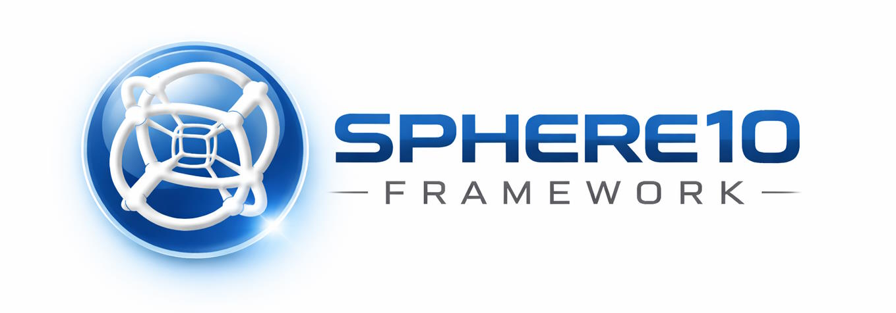

<!-- Copyright (c) 2018-Present Herman Schoenfeld & Sphere 10 Software. All rights reserved. Author: Herman Schoenfeld (sphere10.com) -->

  

# 🧪 Sphere10 Framework: Comprehensive .NET Application Framework

Copyright © Herman Schoenfeld, Sphere 10 Software 2018 - Present

**A mature, production-ready .NET framework** providing a complete foundation for building full-stack applications across desktop, mobile, and web platforms. Originally designed for blockchain systems, Sphere10 Framework has evolved into a comprehensive general-purpose framework offering robust abstractions, advanced data structures, cryptographic primitives, and utilities for high-performance .NET development.

## 🎯 What Sphere10 Framework Provides

**Core Foundation**
- **Unified Architecture**: Consistent patterns for application lifecycle, dependency injection, configuration, and component lifecycle across all platforms
- **Enterprise Data Access**: Abstracted data layer with support for multiple database engines (SQL Server, SQLite, Firebird, NHibernate) and advanced query building
- **Advanced Cryptography**: Comprehensive cryptographic implementations including post-quantum algorithms, digital signatures, and multiple hashing algorithms
- **Multi-Protocol Networking**: TCP, UDP, WebSockets, and RPC frameworks for building distributed systems
- **Rich Serialization**: Flexible binary serialization, JSON support, and streaming implementations

**Application Development**
- **Desktop UI Framework**: Full-featured Windows Forms component library with data binding, validation, and plugin support
- **Web UI**: Blazor-based component library with wizards, modals, grids, and responsive layouts for modern web applications
- **Cross-Platform**: Run applications on Windows, macOS, iOS, Android, or .NET Core/5+
- **Plugin Architecture**: Dynamic plugin loading and lifecycle management for extensible applications

**Specialized Features**
- **Memory Efficiency**: Advanced collections, paged data structures, and streaming for handling large datasets
- **Graphics & Drawing**: Cross-platform drawing utilities and image manipulation
- **Performance**: Caching, connection pooling, and optimized algorithms
- **Testing**: Comprehensive testing framework and utilities for unit and integration testing

## � Project Structure

The Sphere10 Framework framework consists of **45+ projects** organized by category within `src/`, `tests/`, and `utils/`:

### 🔧 Core Framework & Utilities

| Project | Purpose |
|---------|---------|
| [**Sphere10 Framework**](src/Sphere10 Framework/README.md) | General-purpose core library with utilities for caching, collections, cryptography, serialization, streaming, and more |
| [**Sphere10.Framework.Application**](src/Sphere10.Framework.Application/README.md) | Application lifecycle, dependency injection, command-line interface, and presentation framework |
| [**Sphere10.Framework.Communications**](src/Sphere10.Framework.Communications/README.md) | Multi-protocol networking layer: TCP, UDP, WebSockets, RPC, and pipes |
| [**Sphere10.Framework.Generators**](src/Sphere10.Framework.Generators/README.md) | C# source generators for compile-time code generation |
| [**HashLib4CSharp**](src/HashLib4CSharp/README.md) | Hashing library with support for MD5, SHA, BLAKE2, CRC, checksums, and more |

### 🔐 Cryptography & Security

| Project | Purpose |
|---------|---------|
| [**Sphere10.Framework.CryptoEx**](src/Sphere10.Framework.CryptoEx/README.md) | Extended cryptography: Bitcoin (SECP256k1), elliptic curves, hash functions, post-quantum algorithms |
| [**Sphere10.Framework.Consensus**](src/Sphere10.Framework.Consensus/README.md) | Blockchain consensus mechanisms and validation rules framework |

### 💾 Data Access & Persistence

| Project | Purpose |
|---------|---------|
| [**Sphere10.Framework.Data**](src/Sphere10.Framework.Data/README.md) | Data access abstraction layer with ADO.NET enhancements, SQL query building, CSV support |
| [**Sphere10.Framework.Data.Sqlite**](src/Sphere10.Framework.Data.Sqlite/README.md) | SQLite implementation for embedded databases |
| [**Sphere10.Framework.Data.Firebird**](src/Sphere10.Framework.Data.Firebird/README.md) | Firebird database implementation |
| [**Sphere10.Framework.Data.MSSQL**](src/Sphere10.Framework.Data.MSSQL/README.md) | Microsoft SQL Server implementation |
| [**Sphere10.Framework.Data.NHibernate**](src/Sphere10.Framework.Data.NHibernate/README.md) | NHibernate ORM integration |

### 🖥️ Desktop & Windows

| Project | Purpose |
|---------|---------|
| [**Sphere10.Framework.Windows**](src/Sphere10.Framework.Windows/README.md) | Windows platform integration: registry, services, event logging |
| [**Sphere10.Framework.Windows.Forms**](src/Sphere10.Framework.Windows.Forms/README.md) | Windows Forms UI framework and components |
| [**Sphere10.Framework.Windows.Forms.Sqlite**](src/Sphere10.Framework.Windows.Forms.Sqlite/README.md) | Windows Forms with SQLite data binding |
| [**Sphere10.Framework.Windows.Forms.Firebird**](src/Sphere10.Framework.Windows.Forms.Firebird/README.md) | Windows Forms with Firebird data binding |
| [**Sphere10.Framework.Windows.Forms.MSSQL**](src/Sphere10.Framework.Windows.Forms.MSSQL/README.md) | Windows Forms with SQL Server data binding |
| [**Sphere10.Framework.Windows.LevelDB**](src/Sphere10.Framework.Windows.LevelDB/README.md) | LevelDB integration for fast key-value storage |

### 🌐 Web & Cross-Platform

| Project | Purpose |
|---------|---------|
| [**Sphere10.Framework.Web.AspNetCore**](src/Sphere10.Framework.Web.AspNetCore/README.md) | ASP.NET Core integration: middleware, filters, routing, forms |
| [**Sphere10.Framework.Drawing**](src/Sphere10.Framework.Drawing/README.md) | Cross-platform graphics and drawing utilities |
| [**Sphere10.Framework.NET**](src/Sphere10.Framework.NET/README.md) | .NET Framework-specific utilities and type introspection |
| [**Sphere10.Framework.NETCore**](src/Sphere10.Framework.NETCore/README.md) | .NET Core and modern .NET utilities |
| [**Sphere10.Framework.iOS**](src/Sphere10.Framework.iOS/README.md) | Xamarin.iOS integration for native iOS apps |
| [**Sphere10.Framework.Android**](src/Sphere10.Framework.Android/README.md) | Xamarin.Android integration for native Android apps |
| [**Sphere10.Framework.macOS**](src/Sphere10.Framework.macOS/README.md) | Xamarin.macOS integration for native macOS apps |

### ⛓️ Blockchain & DApps

| Project | Purpose |
|---------|---------|
| [**Sphere10.Framework.DApp.Core**](src/Sphere10.Framework.DApp.Core/README.md) | Core blockchain and DApp framework: blocks, transactions, wallets, plugins, persistence |
| [**Sphere10.Framework.DApp.Node**](src/Sphere10.Framework.DApp.Node/README.md) | Full-featured blockchain node with terminal UI, consensus, networking, wallet, and JSON APIs |
| [**Sphere10.Framework.DApp.Host**](src/Sphere10.Framework.DApp.Host/README.md) | Host process for running DApp nodes as services |

## ✅ Test Projects

The `tests/` directory contains **2000+ comprehensive tests** covering all framework subsystems:

| Test Project | Purpose |
|--------------|---------|
| **HashLib4CSharp.Tests** | Tests for hashing algorithms |
| **Sphere10.Framework.Communications.Tests** | Networking and RPC tests |
| **Sphere10.Framework.CryptoEx.Tests** | Cryptography implementation tests |
| **Sphere10.Framework.DApp.Core.Tests** | DApp framework tests |
| **Sphere10.Framework.Data.Tests** | Database access layer tests |
| **Sphere10.Framework.NET.Tests** | .NET framework utility tests |
| **Sphere10.Framework.NETCore.Tests** | .NET Core utility tests |
| **Sphere10.Framework.Tests** | Core framework tests |
| **Sphere10.Framework.Windows.LevelDB.Tests** | LevelDB integration tests |
| **Sphere10.Framework.Windows.Tests** | Windows platform tests |

## 🎨 Presentation & UI Layer

The `blackhole/` directory contains the Blazor-based presentation layer and alternative implementations:

| Project | Purpose |
|---------|---------|
| [**Sphere10.Framework.DApp.Presentation**](blackhole/Sphere10.Framework.DApp.Presentation/README.md) | Blazor component library with wizards, modals, grids, and UI components |
| [**Sphere10.Framework.DApp.Presentation.Loader**](blackhole/Sphere10.Framework.DApp.Presentation.Loader/README.md) | Blazor WebAssembly host for the presentation layer |
| [**Sphere10.Framework.DApp.Presentation.WidgetGallery**](blackhole/Sphere10.Framework.DApp.Presentation.WidgetGallery/README.md) | Component showcase and demonstration plugin |
| [**Sphere10.Framework.DApp.Presentation2**](blackhole/Sphere10.Framework.DApp.Presentation2/README.md) | Alternative presentation implementation with advanced patterns |
| [**Sphere10.Framework.DApp.Presentation2.Loader**](blackhole/Sphere10.Framework.DApp.Presentation2.Loader/README.md) | WebAssembly host for the alternative presentation |

## � Documentation & Learning

### 🏗️ Architecture

1. [What is the Sphere10 Framework Framework?](docs/Architecture/Sphere10.Framework.md)
2. [Sphere10 Framework Runtime](docs/Architecture/Runtime.md)
3. [Framework Domains](docs/Architecture/Domains.md)

### ⛓️ Blockchain Technology

4. [Blockchain: Dynamic Merkle Trees](https://sphere10.com/tech/dynamic-merkle-trees)
5. [Blockchain: Real-Time Targeted Difficulty Adjustment Algorithm](blackhole/docs/Blockchain/rtt-asert.pdf)
6. [Post-Quantum Cryptography: Abstract Merkle Signatures (AMS)](https://sphere10.com/tech/ams)
7. [Post-Quantum Cryptography: Winternitz Abstracted Merkle Signatures (WAMS)](https://sphere10.com/tech/wams)
8. [Post-Quantum Cryptography: Faster and Smaller Winternitz Signatures](https://sphere10.com/tech/wots-sharp)

### 📋 Guidelines

9. [What is a 3-tier Architecture?](docs/Guidelines/3-tier-Architecture.md)
10. [Code-Styling Guidelines](docs/Guidelines/Code-Styling.md)

## � Quick Navigation & Resources

- **Getting Started**: See [Sphere10.Framework.DApp.Node](src/Sphere10.Framework.DApp.Node/README.md) to run a blockchain node
- **Web UI**: See [Sphere10.Framework.DApp.Presentation.Loader](blackhole/Sphere10.Framework.DApp.Presentation.Loader/README.md) for the web interface
- **Building DApps**: See [Sphere10.Framework.DApp.Core](src/Sphere10.Framework.DApp.Core/README.md) for core DApp development
- **Database Access**: See [Sphere10.Framework.Data](src/Sphere10.Framework.Data/README.md) for data layer patterns
- **Networking**: See [Sphere10.Framework.Communications](src/Sphere10.Framework.Communications/README.md) for network protocols

